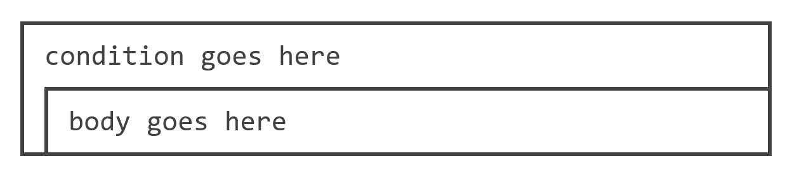
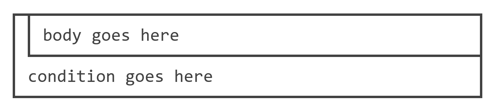
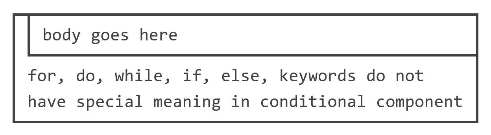
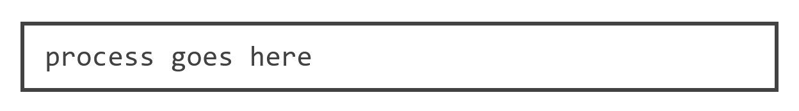
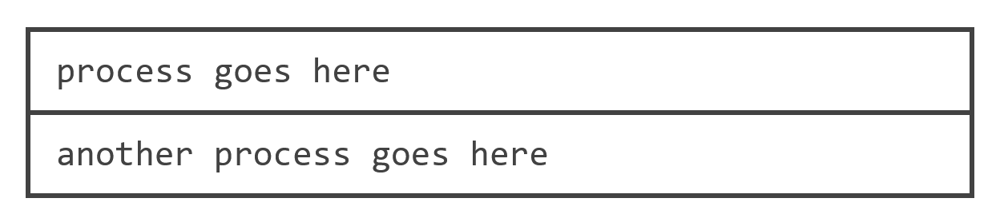
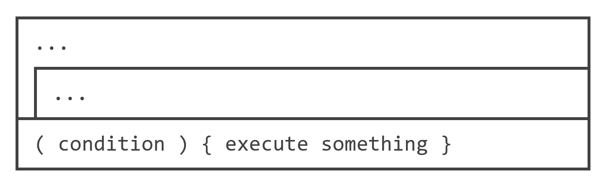

# nassi-shneiderman-diagram-builder-online

This project is a successor to my [Nassi-Shneiderman Diagram Builder](https://github.com/Eurydia/nassi-shneiderman-diagram-builder).

It is a web application that allows you to create Nassi-Shneiderman diagrams using C-style code.

It features two main components; the editor and the preview.
Unfortunately, there is no native ways to capture and download HTML nodes as images so users are advised to use a screenshot tool to capture the preview.

The current method uses `html2image` and `file-saver` to capture and download the preview as a PNG image.
One issue with `html2image` is that it does not campture font families correctly.
So the captured image has a different font family (serif) than the preview (monospace).

## Syntax

There are very few syntax rules that you need to follow in order to generate a valid diagram.

### BNF

```text

<program> ::= <statement>

<statement> ::=   <tokens>* ';' |
                  <for-statement> |
                  <while-statement> |
                  <do-while-statement> |
                  <if-statement>

<for-statement> ::= 'for' '(' <token>* ')' '{' <statement>* '}'
<while-statement> ::= 'while' '(' <token>* ')' '{' <statement>* '}'
<do-while-statement> ::= 'do' '{' <statement>* '}' 'while' '(' <token>* ')' ';'
<if-statement> ::= 'if' '(' <token>* ')' '{' <statement>* '}' ['else' '{'[<statement>* '}']

<token> ::= <any-character>+
<any-character> ::= <letter> | <digits> | <symbols>
```

### If statements and if-else statements

If-statements are triggered by the `if` keyword followed by a condition in parentheses and a body in curly braces.

```text
if (condition goes here) {
  body goes here;
}
```


In this case the else branch is empty so it is displayed as triple dots.

To add an else branch, simply add an `else` keyword followed by a body in curly braces.

```text
if (condition goes here) {
  body goes here;
} else {
  another body goes here;
}
```


Keywords inside condition components are suppressed and do not carry special meaning.

```text
if (for, do, while, if, else,
keywords do not have special meaning
in conditional component
) {
  body goes here;
}
```


Keywords inside body component are not suppressed and will be treated as keywords.

```text
if (condition goes here) {
  while (true) {
    execute something;
  }
}
```


### For loops and while loops

Both for loops and while loops are triggered by the `for` and `while` keywords respectively followed by a condition in parentheses and a body in curly braces.

Internally, they trigger a "test-first loop".
So the condition is placed before the body.
This means they have the same syntax and they are simply aliases of each other.

I only included both of them for completeness.

```text
for (condition goes here) {
  body goes here;
}
```



Keywords inside condition components are suppressed and do not carry special meaning.

```text
for (for, do, while, if, else,
keywords do not have special meaning
in conditional component) {
  body goes here;
}
```


Keywords inside body component are not suppressed and will be treated as keywords.

```text
for (condition goes here) {
  while (another condition goes here) {
    execute something;
  }
}
```


### Do-while loops

Do-while loops are triggered by the `do` keyword followed by a body in curly braces and the `while` keyword followed by a condition in parentheses and a semicolon.

They are similar to for loops and while loops except that the condition is placed after the body.
The Nassi-Shneiderman diagram refers to them as "test-last loops".

```text
do {
  body goes here;
} while (condition goes here);
```



Keywords inside condition components are suppressed and do not carry special meaning.

```text
do {
  body goes here;
} while (for, do, while, if, else,
keywords do not have special meaning
in conditional component);
```



Keywords inside body component are not suppressed and will be treated as keywords.

```text
do {
  while (another condition goes here) {
    execute something;
  }
} while (condition goes here);
```


### Processes

Regular statements which do not fall into any of the above categories are treated as processes.

```text
process goes here;
```



Processes are separated by semicolons.

```text
process goes here;
another process goes here;
```



In the case of syntax errors, the parser defaults to simple process nodes.
This means that the diagram may not be accurate if there are syntax errors.

```text
for e(condition) {
  execute something
}
```



## Implementation

The project is written in TypeScript and uses React with UI components from Material-UI.

The editor is implemented using [CodeMirror](https://codemirror.net/) to provide better syntax highlighting and code editing experience than Mui's TextField with multiline enabled.

The lexer and parser can be found in `src/ast/lexer.ts` and `src/ast/parser.ts` respectively.

### Lexer

The lexer is a very simple one that only supports a subset of C-style syntax.
It can detect the following tokens:

- Keywords: `if`, `else`, `while`, `for`, `do`
- Literal tokens: `(`, `)`, `{`, `}`, `;`
- Symbols: everything else

### Parser

The parser is a recursive descent parser that parses the tokens generated by the lexer.

It can geenrate the following AST nodes:

- `for` loops,
- `while` loops,
- `do-while` loops,
- `if` statements,
- `if-else` statements,

## Devleopment notes

## Resources

- Nassi–Shneiderman diagram (Wikipedia): https://en.wikipedia.org/wiki/Nassi%E2%80%93Shneiderman_diagram

## Credits

- Site favicon
  - Graphics Title: 1f419.svg
  - Graphics Author: Copyright 2020 Twitter, Inc and other contributors (https://github.com/twitter/twemoji)
  - Graphics Source: https://github.com/twitter/twemoji/blob/master/assets/svg/1f419.svg
  - Graphics License: CC-BY 4.0 (https://creativecommons.org/licenses/by/4.0/)
